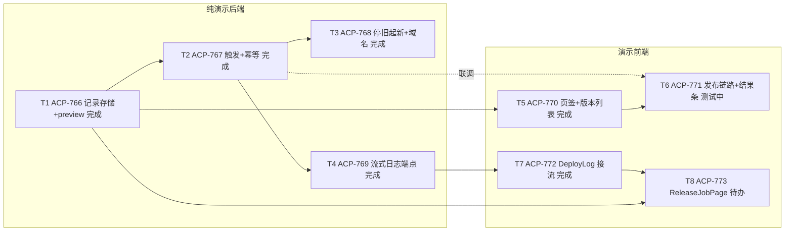

# 08 发布应用 · 开发任务清单（task-breakdown 产出，交 master 审）

依据：`raw/ai-studio-acceptance/08-publish-app.md`（定稿，D3 已签字为正式契约）、
`frontend-component-tree.md`、`website/src/apps/ai-studio/` 与
`src/kiro_crew/apps/builtins/ai_studio/backend/` 现状实读。
只拆 08 范围；testid 与章节引用逐字对文档。建议测试文件名可调，**testid 断言不可调**。

## T1 [后台] 实现发布记录与逐版本形态判定端点

- 范围：release-job / release 两类记录的存储与查询（两概念不混，§〇-2 拍板）；
  `GET /publish/records?project`（B3 字段齐全：form/version/requirementVersion/
  jiraTaskIds/status/url；B4 两态与「最新发布 hash」由此推导）；
  `GET /publish/preview?project&version`（B1：form full|demo|rejected、reason 非空）。
  **判定源 = git tag 的标签（demo/full），不读验收记录接口；B1 的 acceptanceRef 作废**
  （owner 2026-09-23 拍板，req-design 同步修 08 正文）。**不做发布触发（T2），不碰前端，不做日志（T4）**。
- 文件与 testid：`src/kiro_crew/apps/builtins/ai_studio/backend/routes.py` 及存储层；
  新增 `test/test_ai_studio_publish_records.py`。无前端 testid。
- 验收命令：`python3 -m pytest test/test_ai_studio_publish_records.py test/test_ai_studio_projects.py -q`
- 依赖：无前置（owner 拍板后不再等 07 验收记录）；blocks T2、T5。
- 拍板依据：§三 B1/B3/B4；§〇-2「两个概念，Owner 已拍板」；owner 2026-09-23 拍板（判定源=git tag）。

## T2 [后台] 实现发布触发端点与 job 状态机

- 范围：`POST /publish`（B2）：hash ≠ 最新发布 hash → 新建部署返回 deploymentId；
  相同 → 不新建、返回既有 deploymentId + `idempotent: true`（D2）；hash 非最新（含发过的旧 hash）
  → 正常新建（D3 回滚式重发，正式契约）；同 hash 进行中再调 → 409；失败 → status:"failed"。
  job 三态流转（发布中/成功/失败）。触发时写入记录的 `jiraTaskIds` 取自**项目当前关联的任务 md
  集合**（owner 拍板：DAG 拆解 agent 发 Jira 后把任务号回写 md，md 文件名与任务号双向绑定）。
  **实例真停旧起新与域名生效在 T3 验收；本单只验端点应答与记录状态**。
- 文件与 testid：`backend/routes.py` 及存储层；新增 `test/test_ai_studio_publish_trigger.py`。
- 验收命令：`python3 -m pytest test/test_ai_studio_publish_trigger.py -q`
- 依赖：blocked by T1；blocks T3、T4、T6。
- 拍板依据：§三 B2 与「幂等与并发」段；§二 D2/D3。

## T3 [后台] 实现单实例替换执行与发布域名

- 范围：发布成功后应用在 `{版本号}-{应用名}-{工号}.gb10.jereh-pe.cn` 服务（域名逐字模板）；
  **工号从 JWT 的 `sub` 取；开发环境不校验 JWT 签名与有效期**（owner 2026-09-23 拍板）。
  同一时刻同一项目单实例，新旧不并存；发布失败不留对外结果。含 §四 进程级四条。
  **不碰前端、不碰日志流（T4）**。
- 文件与 testid：ai_studio 后台执行层；域名模板断言进 pytest；`ai-studio-publish-url-<版本号>`
  的 href 由 T6 前端消费，模板本身在此单断言。
- 验收命令：§四 1–4 全过（发布前旧 URL 200 留证 → 发布 → 旧 PID `kill -0` 失败或旧端口 `ss -tln` 无监听
  → 新 URL 探活 200 + 按被发形态跑最小一条核心断言）；隔离网关步骤照
  `docs/guides/worktree-verification-recipes.md`。
- 依赖：blocked by T2。
- 拍板依据：§〇 域名模板；§四 1–4；§三 B5。

## T4 [后台] 实现发布流式日志端点

- 范围：`GET /publish/<deploymentId>/log` 流式输出（发布中边发边长）；已完成的完整回放。
  路径若调整须同一提交改 08 文档（文档明示）。**不改前端组件（T7）**。
- 文件与 testid：`backend/routes.py` 及执行层日志源；新增 `test/test_ai_studio_publish_log.py`。
- 验收命令：`python3 -m pytest test/test_ai_studio_publish_log.py -q`
  （断言：进行中两次采样行数递增且最终含完成标记；完成态返回全量）
- 依赖：blocked by T2；blocks T7。
- 拍板依据：§〇-2「后台日志流」行与「流式日志」行。

## T5 [前端] 建发布页签的发布视图与行内按钮

- 范围：ToolSidebar 的 releases 页签补挂 `ai-studio-publish-entry`，其内容从 fixture 桩
  换成发布版本列表：`ai-studio-publish-version-list` / `ai-studio-publish-version-row-<版本号>` /
  `ai-studio-publish-version-state` / `ai-studio-publish-reason-<版本号>`；行内发布按钮 `ai-studio-publish-btn-<版本号>`
  在本新组件内自建（072257f52 拍板：**不复用、不改动顶栏 `ReleaseControl`**，其
  `release-btn` testid 不动），**渲染与否按 hash 对比**
  （行 hash vs 最新发布 hash，相同=不渲染且状态「已发布」，不是禁用）；行内形态判定与原因
  （`ai-studio-publish-reason-<版本号>`）取数自 B1，**其源已改 git tag（demo/full），不再承接 07 验收记录**
  （owner 2026-09-23 拍板）；无版本选择器/手输框/确认弹层；四列行内布局。
  **不做点击后的发布链路与结果条（T6）；不碰 dev 页签共用的 ReleasesTool 分支**。
- 文件与 testid：`ToolSidebar.tsx`、新建发布视图组件、`studioApi.ts`（publish 取数）；
  新增 `src/apps/ai-studio/PublishView.test.tsx`；同提交更新 `raw/ai-studio-acceptance/frontend-component-tree.md`。
- 验收命令：`cd website && npx vitest run src/apps/ai-studio/PublishView.test.tsx && npm run i18n:check && npm run build`
- 依赖：blocked by T1；blocks T6。
- 拍板依据：§〇（入口/hash 对比拍板）；§〇-1 区块表与列表；§二 A1/A2/C1/C2/D1/D3；§六 新建表 1–2 行与复用表。

## T6 [前端] 接通行内发布链路与结果条

- 范围：点行内按钮即发（无弹层）→ 轮询刷新；结果条四 testid：`ai-studio-publish-status-<版本号>`、
  `ai-studio-publish-form-badge-<版本号>`、`ai-studio-publish-url-<版本号>`（href 逐字模板、新页签）、
  `ai-studio-publish-id-<版本号>`（新页签开 `/release-jobs/<发布号>`）；行状态回写（未发布→已发布、
  按钮从 DOM 消失、其余行不变）；失败提示含原因；409 时不出现两个「发布中」。**不改 ToolSidebar 页签结构
  （T5 产物），不建发布详情页（T8）**。
- 文件与 testid：发布视图组件、`studioApi.ts`；新增 `src/apps/ai-studio/PublishRun.test.tsx`。
- 验收命令：`cd website && npx vitest run src/apps/ai-studio/PublishRun.test.tsx && npm run i18n:check && npm run build`
- 依赖：blocked by T2、T5。
- 拍板依据：§二 A3–A8、场景 B、C/D 的行为面；§〇-1「行内两个状态元素的分工」；§三「幂等与并发」；§六 新建表第 3 行。

## T7 [前端] 让 DeployLog 承载真实日志流

- 范围：复用组件改造——`DeployLog.tsx` 从静态 fixture 文本改为可接真实日志流（流式增长、
  完成回放），保留 `deploy-log-<部署id>` testid 不丢，形态可被发布详情页日志区复用。
  **不新建页面，不动 ReleaseJobPage**。
- 文件与 testid：`DeployLog.tsx`；新增 `src/apps/ai-studio/DeployLog.test.tsx`。
- 验收命令：`cd website && npx vitest run src/apps/ai-studio/DeployLog.test.tsx`
- 依赖：blocked by T4；blocks T8。
- 拍板依据：§六 复用表 DeployLog 行；§〇-2「日志渲染复用 DeployLog 形态」。

## T8 [前端] 建 ReleaseJobPage 发布详情页

- 范围：独立路由 `/release-jobs/<发布号>` 新页；`ai-studio-release-job-page`、
  `ai-studio-release-job-history-list` / `ai-studio-release-job-row-<发布号>`（全部 job、进行中的置顶、
  **只读**——行内无重试/取消/删除）、`ai-studio-release-job-status-<发布号>`（仅三态）、
  `ai-studio-release-job-log-<发布号>`（复用 T7 形态：进行中流式增长、完成回放）。
- 文件与 testid：新建 ReleaseJobPage、路由挂载、`studioApi.ts`；新增 `src/apps/ai-studio/ReleaseJobPage.test.tsx`；
  同提交更新 `frontend-component-tree.md`。
- 验收命令：`cd website && npx vitest run src/apps/ai-studio/ReleaseJobPage.test.tsx && npm run i18n:check && npm run build`
- 依赖：blocked by T1、T7。
- 拍板依据：§〇-2 全节（含「列表只读」行，7d212e12a 拍板）；§六 新建表第 4 行。

## 依赖 DAG（定稿复核后，2026-09-23）

Jira 板：父单 ACP-765，子单 ACP-766~773 = T1~T8。复核结论：无缺口，未补拆新子任务
（定稿 08 相对拆分时正文无新增断言点，B1 改 tag 等三处变化已在拍板轮同步进卡片）。

关键路径：T1 → T2 → T4 → T7 → T8。T3 的 build 步骤为演示实现
（可选 buildCommand+静态起服），完整版真实构建器不在本 DAG。

### 演示归属（owner 硬性要求，已逐单写进 Jira 描述）

- 纯演示后端：T1 / T2 / T3 / T4
- 演示前端：T5 / T6 / T7 / T8
- 完整版专属：无（T3 标注了 build 为演示实现）

## 拍板记录（原「待确认」全部落定）

> 问题 6：req-design 定稿（08 commit 072257f52，已并入 main）。
> 问题 1–4：owner 2026-09-23 拍板，req-design 同步在改 08 正文（B1 会变）。
> 问题 5：owner 令「不设 T9」，已删。

- **版本 hash 来源（原问题 1）**：版本 hash = **git commit + git tag**——开发测试完提交后打版本标签，
  tag 注明演示版（demo）还是完整版（full）。故 T1 记录与 B2 的 `commitHash` 是项目级 git 概念，
  不是现状按文档的 `versions/<doc>/<timestamp>`；hash 对比、幂等、回滚全部锚在这个 git hash 上。
- **域名工号（原问题 2）**：从 **JWT 的 `sub`** 取；**开发环境不校验 JWT 签名与有效期**。已写进 T3。
- **形态判定源（原问题 3）**：改判 **git tag 的标签（demo/full）**，**不再读验收记录接口**，
  B1 的 `acceptanceRef` 作废。T1 的记录存储保留，但 **B1 判定不再 blocked by 07**——T1 前置清空。
  T5 行内 reason 取数源随之改（经 B1，源头是 tag）。
- **jiraTaskIds 写入方（原问题 4）**：DAG 任务拆解 agent 写任务 md → 调 CLI/MCP 发布 Jira →
  任务号回写 md（**md 文件名与任务号双向绑定**）；发布记录的 jiraTaskIds 来自项目当前关联的
  任务 md 集合，**T2 触发时写入**。已写进 T2。
- **e2e 脚本单（原问题 5）**：owner 拍板不设，本清单无 T9；§五 整体验收由 master 另行安排，不在本清单。
- **行内发布按钮（原问题 6）**：不复用、不改动顶栏 `ReleaseControl`（`release-btn` 不动），
  `ai-studio-publish-btn-<版本号>` 在发布版本列表新组件内自建。已同步 T5。
